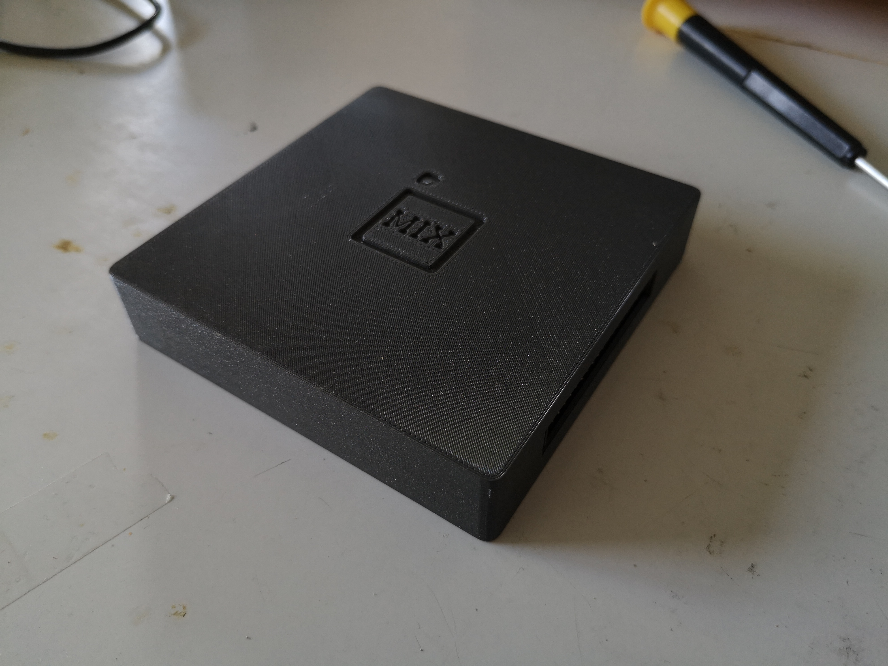
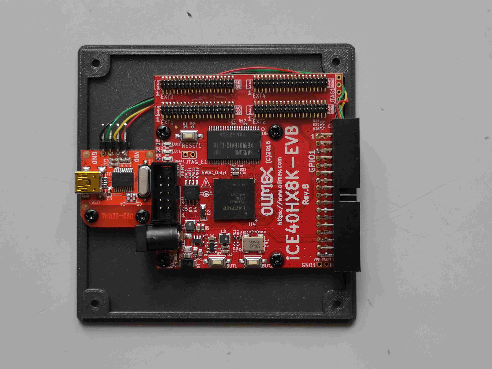
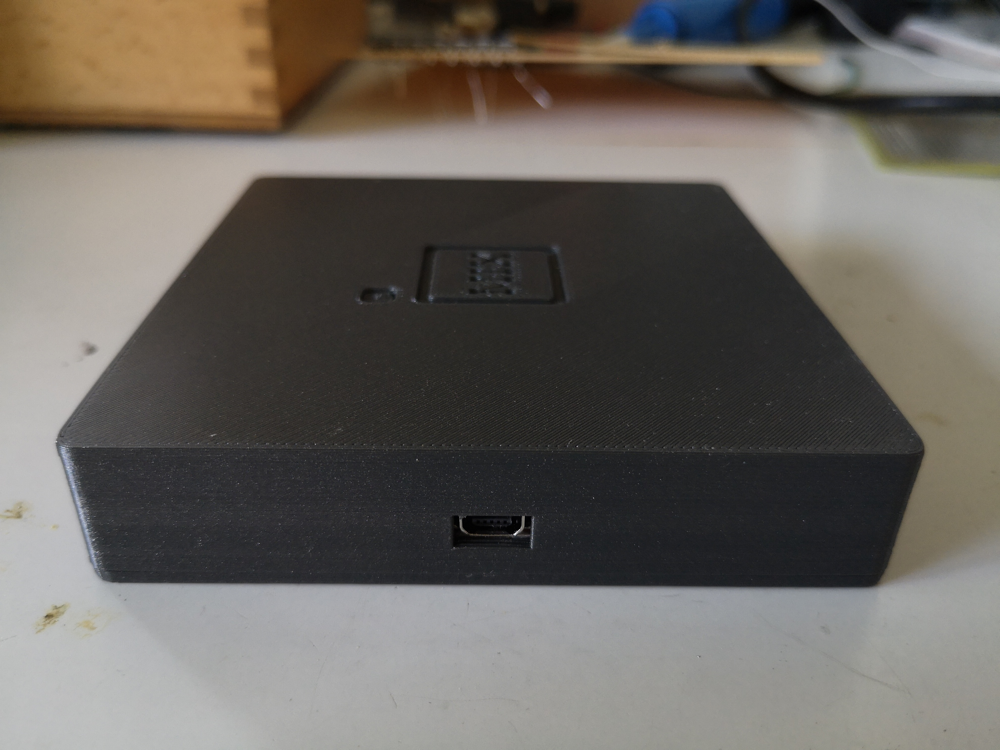
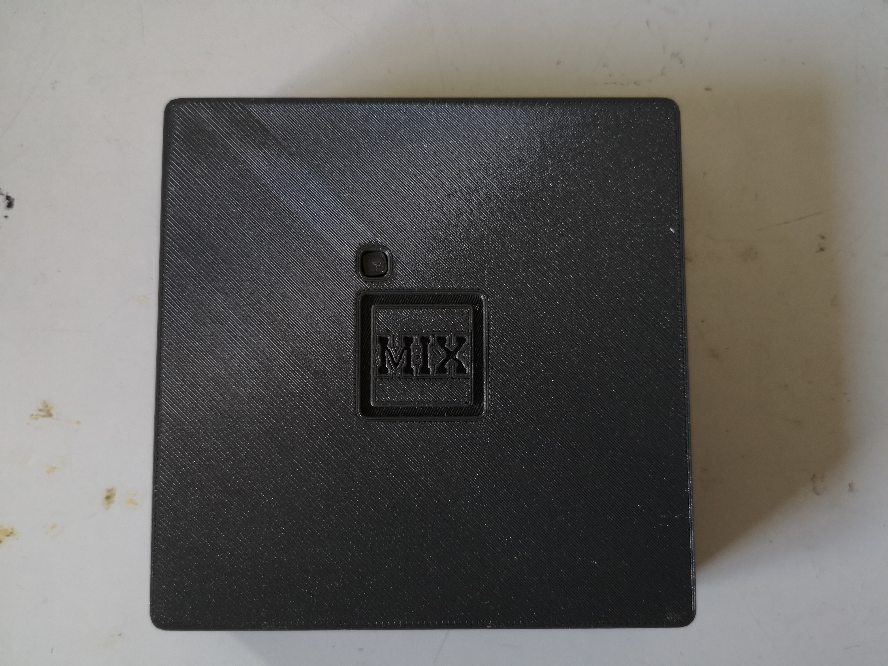
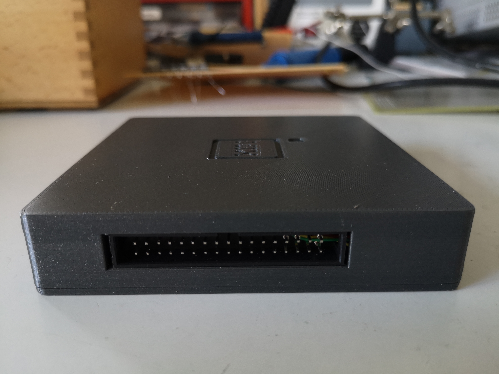
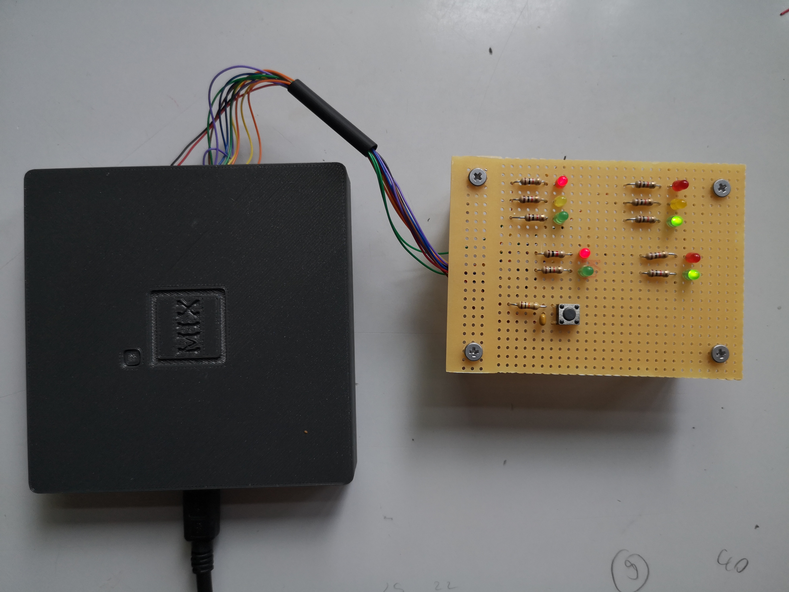

# MIX-fpga

Have you ever heard of Don Knuths (hypothetical) first polyunsaturated computer MIX, the 1009? In this project we will build a binary version of the MIX-Computer as described in "The Art of Computer Programming, Vol. 1" by Donald E. Knuth running on an fpga-board.

The presented implementation is based on the fpga development board iCE40HX8K-EVB from the company Olimex Ltd., which has the nice property of being completely open source. The whole project uses only FOSS free and open source hard- and software, so everybody can build their own MIX following the instructions in `build`




## inside

The MIX computer is composed of two little boards.
1. iCE40HX8K-EVB, the fpga development board from olimex.com
2. USB-serial adapter. Used to power the board with 5V and to in-/output data over serial interface.



## Specifications

### clock
MIX runs on iCE40HX8K-EVB clocked at 25MHz. The basic unit of time 1u corresponds to 40ns, so according to Knuth it's a relatively high priced machine.

### I/O units
In our MIX implementation all character based I/O units (U16-U20) are connected to the USB-connector and can be accessed as UART streams. You can connect MIX with any PC running a terminal emulator (e.g. screen for linux). The terminal should be set to 115200 baud (8N1). A conversion between ASCII and Knuths character codes is done in hardware according to Knuths specification (see TAOCP p. 128).


### commands
All commands exept the floating point arithmetic are implemented (s. list) with execution times corresponding to Knuth's specifications. Special care is given to the correct timings. Even the "sofisticated" commands SRC and SLC, which need a modulo 10 computation are executed in the defined timing of two cycles. The system can easily be extended in various ways:
1. add more commands:
	* Floating point arithmetic
	* logic operators (AND,OR,XOR,NOT), etc.
2. add more hardware:
	* add leds to run the traffic light example
	* add more I/O units

| OP  | Menmonic | Remarks |
| -   | -   | -  |
| 0   | NOP | ok |
| 1   | ADD | ok | 
| 2   | SUB | ok | 
| 3   | MUL | ok | 
| 4   | DIV | ok | 
| 5(0)   | NUM | ok | 
| 5(1)   | CHAR | ok | 
| 5(2)  | HLT | ok | 
| 6   | SHIFT | ok | 
| 7   | MOVE | ok | 
| 8 - 23   | LD(N) | ok | 
| 24 - 33  | ST | ok | 
| 34 -38   | JBUS,IOC,IN,OUT,JRED | ok (USB-UART) | 
| 39 - 47   | JMP | ok | 
| 48 - 55   | INC,DEC,ENT,ENN | ok | 
| 56 - 63  | CMP | ok | 

### the GO button
MIX comes with the "GO button" attached to USB-UART. So after pressing the GO button MIX-programms can be uploaded by sending the "punched cards" to USB-UART.

### build
MIX has a nice box, which can be printed with a 3D printer. Design files can be found in the directory `box`.




## mixal
MIX has been verified with the following programms. The presented outputs have been computed on MIX:
*  p: Compute the first 500 primes

	```
FIRST FIVE HUNDRED PRIMES                                                 
     0002 0233 0547 0877 1229 1597 1993 2371 2749 3187                    
     0003 0239 0557 0881 1231 1601 1997 2377 2753 3191                    
     0005 0241 0563 0883 1237 1607 1999 2381 2767 3203                    
     0007 0251 0569 0887 1249 1609 2003 2383 2777 3209                    
     0011 0257 0571 0907 1259 1613 2011 2389 2789 3217                    
     0013 0263 0577 0911 1277 1619 2017 2393 2791 3221                    
     0017 0269 0587 0919 1279 1621 2027 2399 2797 3229                    
     0019 0271 0593 0929 1283 1627 2029 2411 2801 3251                    
     0023 0277 0599 0937 1289 1637 2039 2417 2803 3253                    
     0029 0281 0601 0941 1291 1657 2053 2423 2819 3257                    
     0031 0283 0607 0947 1297 1663 2063 2437 2833 3259                    
     0037 0293 0613 0953 1301 1667 2069 2441 2837 3271                    
     0041 0307 0617 0967 1303 1669 2081 2447 2843 3299                    
     0043 0311 0619 0971 1307 1693 2083 2459 2851 3301                    
     0047 0313 0631 0977 1319 1697 2087 2467 2857 3307                    
     0053 0317 0641 0983 1321 1699 2089 2473 2861 3313                    
     0059 0331 0643 0991 1327 1709 2099 2477 2879 3319                    
     0061 0337 0647 0997 1361 1721 2111 2503 2887 3323                    
     0067 0347 0653 1009 1367 1723 2113 2521 2897 3329                    
     0071 0349 0659 1013 1373 1733 2129 2531 2903 3331                    
     0073 0353 0661 1019 1381 1741 2131 2539 2909 3343                    
     0079 0359 0673 1021 1399 1747 2137 2543 2917 3347                    
     0083 0367 0677 1031 1409 1753 2141 2549 2927 3359                    
     0089 0373 0683 1033 1423 1759 2143 2551 2939 3361                    
     0097 0379 0691 1039 1427 1777 2153 2557 2953 3371                    
     0101 0383 0701 1049 1429 1783 2161 2579 2957 3373                    
     0103 0389 0709 1051 1433 1787 2179 2591 2963 3389                    
     0107 0397 0719 1061 1439 1789 2203 2593 2969 3391                    
     0109 0401 0727 1063 1447 1801 2207 2609 2971 3407                    
     0113 0409 0733 1069 1451 1811 2213 2617 2999 3413                    
     0127 0419 0739 1087 1453 1823 2221 2621 3001 3433                    
     0131 0421 0743 1091 1459 1831 2237 2633 3011 3449                    
     0137 0431 0751 1093 1471 1847 2239 2647 3019 3457                    
     0139 0433 0757 1097 1481 1861 2243 2657 3023 3461                    
     0149 0439 0761 1103 1483 1867 2251 2659 3037 3463                    
     0151 0443 0769 1109 1487 1871 2267 2663 3041 3467                    
     0157 0449 0773 1117 1489 1873 2269 2671 3049 3469                    
     0163 0457 0787 1123 1493 1877 2273 2677 3061 3491                    
     0167 0461 0797 1129 1499 1879 2281 2683 3067 3499                    
     0173 0463 0809 1151 1511 1889 2287 2687 3079 3511                    
     0179 0467 0811 1153 1523 1901 2293 2689 3083 3517                    
     0181 0479 0821 1163 1531 1907 2297 2693 3089 3527                    
     0191 0487 0823 1171 1543 1913 2309 2699 3109 3529                    
     0193 0491 0827 1181 1549 1931 2311 2707 3119 3533                    
     0197 0499 0829 1187 1553 1933 2333 2711 3121 3539                    
     0199 0503 0839 1193 1559 1949 2339 2713 3137 3541                    
     0211 0509 0853 1201 1567 1951 2341 2719 3163 3547                    
     0223 0521 0857 1213 1571 1973 2347 2729 3167 3557                    
     0227 0523 0859 1217 1579 1979 2351 2731 3169 3559                    
     0229 0541 0863 1223 1583 1987 2357 2741 3181 3571  
	```
* e: compute easter dates from 1950-2000
```
	WELCOME TO MIX. 1U = 30NS. U19 @115200 BAUD (8N1).                    
	 09   APRIL,    01950                                             
	 25   MARCH,    01951                                             
	 13   APRIL,    01952                                             
	 05   APRIL,    01953                                             
	 18   APRIL,    01954                                             
	 10   APRIL,    01955                                             
	 01   APRIL,    01956                                             
	 21   APRIL,    01957                                             
	 06   APRIL,    01958                                             
	 29   MARCH,    01959                                             
	 17   APRIL,    01960                                             
	 02   APRIL,    01961                                             
	 22   APRIL,    01962                                             
	 14   APRIL,    01963                                             
	 29   MARCH,    01964                                             
	 18   APRIL,    01965                                             
	 10   APRIL,    01966                                             
	 26   MARCH,    01967                                             
	 14   APRIL,    01968                                             
	 06   APRIL,    01969                                             
	 29   MARCH,    01970                                             
	 11   APRIL,    01971                                             
	 02   APRIL,    01972                                             
	 22   APRIL,    01973                                             
	 14   APRIL,    01974                                             
	 30   MARCH,    01975                                             
	 18   APRIL,    01976                                             
	 10   APRIL,    01977                                             
	 26   MARCH,    01978                                             
	 15   APRIL,    01979                                             
	 06   APRIL,    01980                                             
	 19   APRIL,    01981                                             
	 11   APRIL,    01982                                             
	 03   APRIL,    01983                                             
	 22   APRIL,    01984                                             
	 07   APRIL,    01985                                             
	 30   MARCH,    01986                                             
	 19   APRIL,    01987                                             
	 03   APRIL,    01988                                             
	 26   MARCH,    01989                                             
	 15   APRIL,    01990                                             
	 31   MARCH,    01991                                             
	 19   APRIL,    01992                                             
	 11   APRIL,    01993                                             
	 03   APRIL,    01994                                             
	 16   APRIL,    01995                                             
	 07   APRIL,    01996                                             
	 30   MARCH,    01997                                             
	 12   APRIL,    01998                                             
	 04   APRIL,    01999                                             
	 23   APRIL,    02000                                             
```
		

* t: control the traffic signal of the corner del Mar Avenue/Berkeley Avenue. MIX is NOT a simulatin/emulation. It's real hardware. So you can drive the LEDs with the output of RegisterX:
	

## Comments or question
.. are welcome to mi.schroeder@netcologne.de