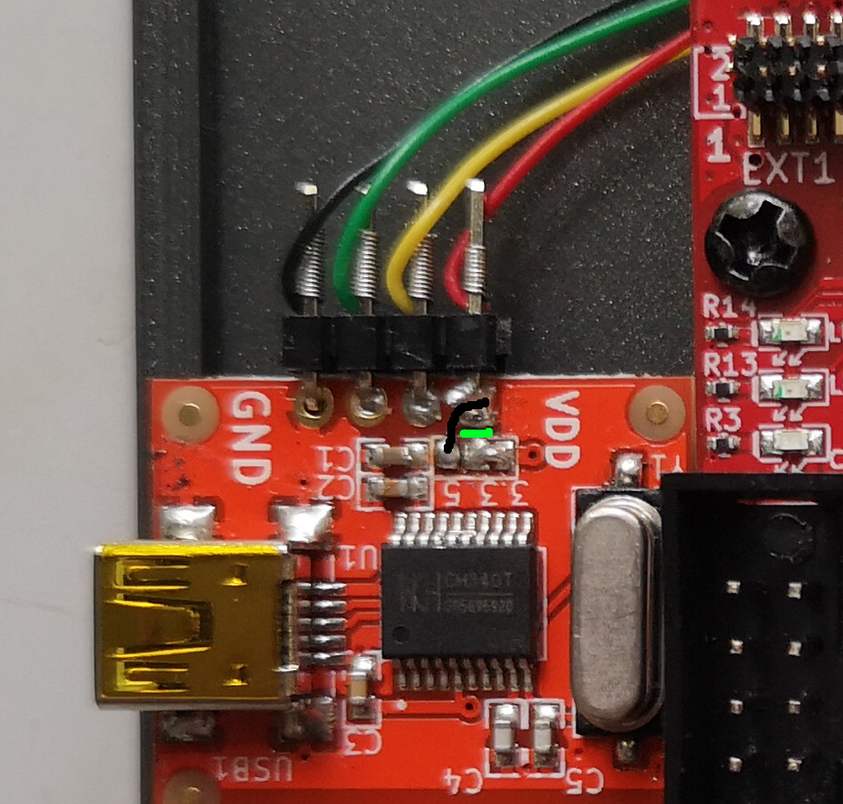

# Build your own MIX

The project runs on iCE40HX8K-EVB fpga from Olimex Ltd. The whole project uses only FOSS soft- and hardware. With little modifications it should run on any fpga board available out in the wild.

## requirement
1. fpga board (iCE40HX8K-EVB), programmer device (Olimexino 32u4), idc10 cable (cable-IDC10) and USB-UART-board (BB-CH340T).  
Consider to buy at Olimex Ltd. https://www.olimex.com, the company with the highest number of registered OSHW-projects.

2. fpga toolchain. The project was developed with apio (https://github.com/FPGAwars/apio), a software suite based on project icestorm (http://www.clifford.at/icestorm/) from Clifford Wolf.

	```
	pip install -U apio
	apio install ice40
	apio install scons
	apio install iverilog
	apio install yosys
	sudo apt install gtkwave
	```
7.  install assembler and simulator for MIX.
	```
	sudo apt install mdk
	```
4.  install terminal to connect to MIX over USB-UART.
	```
	sudo apt install screen
	```
	
## build

1. Cd into the directory `rtl` and build the project

	```
	cd rtl
	apio build -v
	```
2. Connect the fpga board with olimexino-32u4 programmer to upload the bitstream file:

	```
	apio upload
	```
3. Connect USB-UART-board (BB-CH340T) with iCE40HX8K-EVB.
	To use USB-Serial adapter as power source we must cut with a cutter knife the connection marked in GREEN and solder a bridge BLACK between the right most terminal (VDD) and the 5V pad.
	This will ensure that the right most terminal connector (red cable) get's 5Volt, which will be used to power the fpga board. But the UART signals (green and yellow cables) are leveled to 3.3V, which corresponds to the in-/output signal level of fpga-connector GPIO1.
	
 
 
The 4 wires are connected to the GPIO connector on the right side of iCE40HX8K-EVB according to the following table. Compare with schematic in `pics/iCE40HX8K-EVB_RevB.pdf`.

|color| USB-Serial  | GPIO (iCE40-HX8K-EVB) | 
|-|-|-|
|black | GND   | 2   |
| green | RX  | 7 |
| yellow | TX | 5 |
| red | VDD | 1 |
	