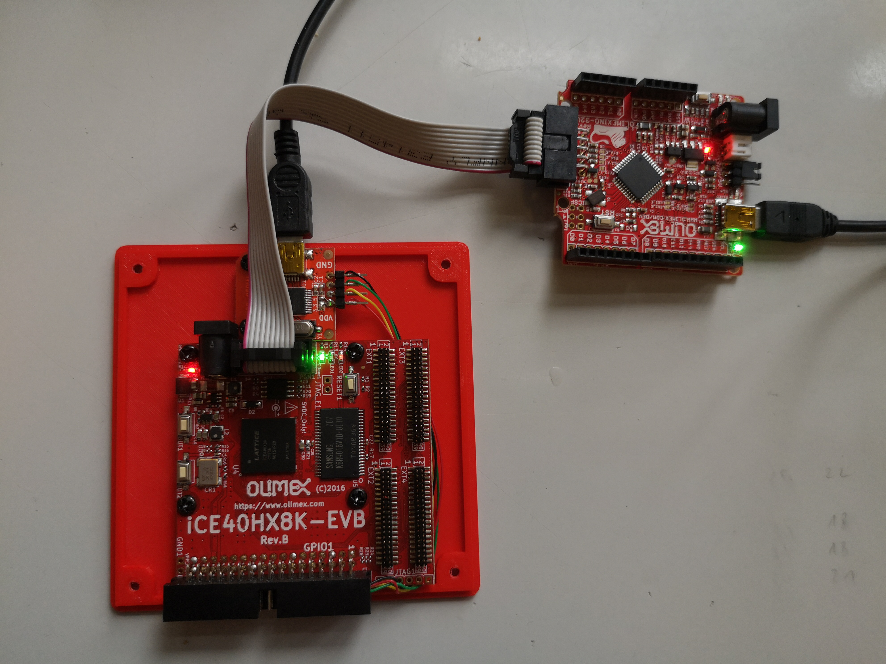
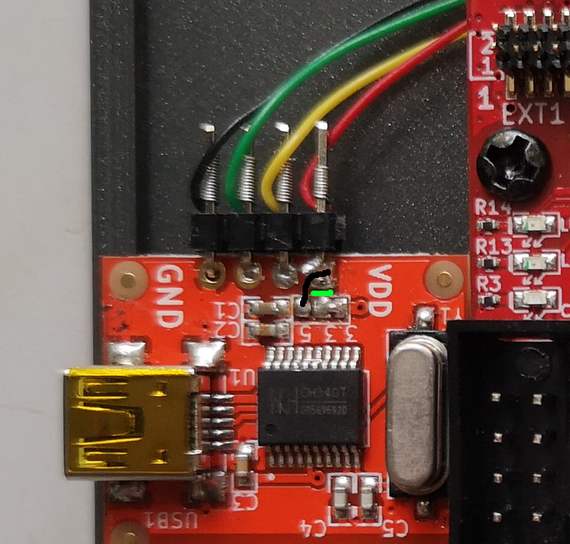
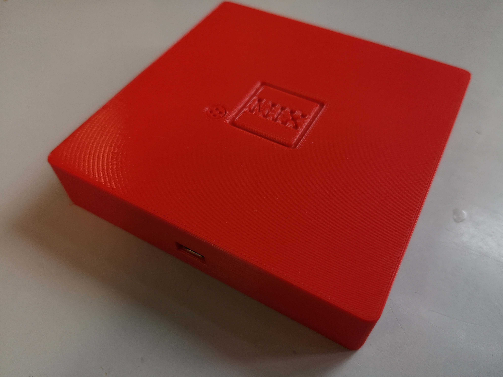
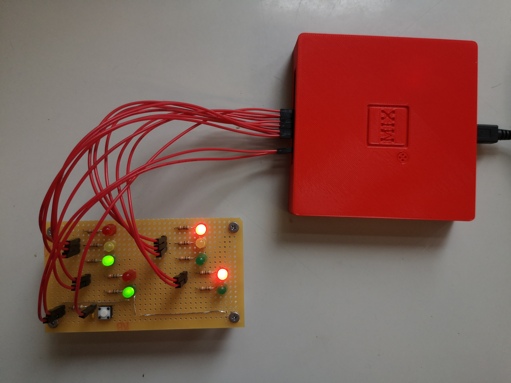
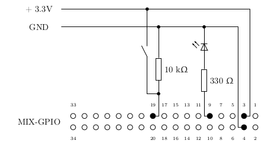

## Build your own MIX and/or modify the fpga design

The project runs on iCE40HX8K-EVB fpga from Olimex Ltd. The whole project uses only FOSS soft- and hardware. With little modifications it should run on any fpga board available out in the wild.

### requirement
1. fpga board (iCE40HX8K-EVB), programmer device (Olimexino 32u4), idc10 cable (cable-IDC10) and USB-UART-board (BB-CH340T).  
Consider to buy at Olimex Ltd. https://www.olimex.com, the company with the highest number of registered OSHW-projects. To use Olimexino 32u4 as programmer for the fpga board, you first have to install `iceprogduino` (see. instructions on olimex.com).

	```
	$ cd build/iceprogduino
	$ make
	$ sudo make install
	```

2. fpga toolchain. The project was developed with apio (https://github.com/FPGAwars/apio), a free and open source software suite based on project icestorm (http://www.clifford.at/icestorm/) from Clifford Wolf.

	```
	$ sudo apt install python3 pip3
	$ sudo pip3 install -U apio
	$ apio install ice40
	$ apio install scons
	$ apio install iverilog
	$ apio install yosys
	$ sudo apt install gtkwave
	```

4.  install terminal program to connect to MIX over USB-UART.
5.  
	```
	$ sudo apt install screen
	```
	
### FPGA iCE40HX8K-EVB
Build the project and upload the circuit design to the fpga:

1. cd into the directory `rtl` and build the project

	```
	$ cd rtl
	$ apio clean
	$ apio build -v
	```
	
2. Connect the fpga board with olimexino-32u4 programmer. Use two USB cables to power both boards.

 	

3. Upload the bitstream file to fpga board.

	```
	$ apio upload
	```

### serial adapter BB-CH340T
The serial adapter BB-CH340T is used to:

1. Power MIX with 5Volt from USB cable
2. Serial communication to MIX over I/O Unit 16-20.

 
To use USB-Serial adapter as power source we must do a little modification on the board:

1. cut with a cutter knife the connection marked in GREEN, and
2. solder a bridge BLACK between the right most terminal (VDD) and the 5V pad.

This will ensure that the right most terminal connector (red cable) get's 5Volt form USB, which will be used to power the fpga board. But the UART signals (green and yellow cables) are still leveled to 3.3V, which corresponds to the in-/output signal level of fpga-connector GPIO1.
	
 
 
The 4 wires are connected to the GPIO connector on the right side of iCE40HX8K-EVB according to the following table. Compare with schematic in `doc/iCE40HX8K-EVB_RevB.pdf` and `doc/bb_ch340t.png`.

| color  | USB-Serial  | GPIO (iCE40-HX8K-EVB)| 
|--------|-------------|----------------------|
| black  | GND         | 2                    |
| green  | RX          | 7                    |
| yellow | TX          | 5                    |
| red    | VDD         | 1                    |

### GO button
We will implement the code needed by the GO button as proposed in  exercise 26 in chapter 1.3.1 of TAOCP (see p. 510).

#### prepare the software
The mixal program can be found in `go/go.mixal`. It starts at location 4000 (which is implemented in fpga but not used by MIX). The programm spits out the welcome message. The JMP instruction at memory cell 4095 will jmp to location 0000 and storing a +0000 in the J-Register, because beeing a binary version with 12 bit program counter the next execution address without the JMP instruction would equally yield 4095 + 0001 = 0000.

```
           ORIG 4000                                                            
           JMP  START                                                           
WELCOME    ALF  WELCO                                                           
           ALF  ME TO                                                           
           ALF   MIX.                                                           
           ALF   1U =                                                           
           ALF   42NS                                                           
           ALF  . U16                                                           
           ALF  -U20                                                            
           ALF  USB-U                                                           
           ALF  ART.                                                            
           ALF  U8 10                                                           
           ALF  00 BL                                                           
           ALF  OCKS.                                                           
           ALF   FPU.                                                           
           ORIG 4091                                                            
START      OUT  WELCOME(17)                                                     
           JBUS *(17)                                                           
NEXT       IN   0(16)                                                           
           JBUS *(16)                                                           
           JMP  0                                                               
           END  START                                                           
```

First we translate the mixal programm to binary code. This is done with the the assembler `mixal/tools/asm.py`.

```
$ ../../mixal/tools/asm.py go.mixal
$ cat go.mls
```

```
                     0001            ORIG 4000 
4000 + 4091 00 00 39 0002            JMP  START 
4001 + 1669 13 03 16 0003 WELCOME    ALF  WELCO
4002 + 0901 00 23 16 0004            ALF  ME TO
4003 + 0014 09 27 40 0005            ALF   MIX.
4004 + 0031 24 00 48 0006            ALF   1U =
4005 + 0034 32 15 22 0007            ALF   42NS
4006 + 2560 24 31 36 0008            ALF  . U16
4007 + 2904 32 30 00 0009            ALF  -U20 
4008 + 1558 02 45 24 0010            ALF  USB-U
4009 + 0083 23 40 00 0011            ALF  ART. 
4010 + 1574 00 31 30 0012            ALF  U8 10
4011 + 1950 00 02 13 0013            ALF  00 BL
4012 + 1027 12 22 40 0014            ALF  OCKS.
4013 + 0006 17 24 40 0015            ALF   FPU.
                     0016            ORIG 4091 
4091 + 4001 00 17 37 0017 START      OUT  WELCOME(17) 
4092 + 4092 00 17 34 0018            JBUS *(17) 
4093 + 0000 00 16 36 0019 NEXT       IN   0(16) 
4094 + 4094 00 16 34 0020            JBUS *(16) 
4095 + 0000 00 00 39 0021            JMP  0 
                     0022            END  START 
                                     TRANS 4091
                          * SYMBOL TABLE
                          *          EQU  4096
                          WELCOME    EQU  4001
                          START      EQU  4091
                          NEXT       EQU  4093
```


Next we must translate the binary code into a binary format readable by the fpga toolchain. This can be done with the python script `mixal/tools/mls2bin.py`.

```
$ ../../mixal/tools/mls2bin.py go.mls
```

The python scripts reads the listing file `go.mls`, extracts the code and writes it in the file `go.bin`.

Inspect the binary file `go.bin`

```
$ cat go.bin
```


```
0000000000000000000000000000000
0000000000000000000000000000000
0000000000000000000000000000000
...
...
0000000000000000000000000000000
0111110100001000000010011100101
0111111111100000000010011100010
0000000000000000000010000100100
0111111111110000000010000100010
0000000000000000000000000100111
```

The output contain the program code expressed as binary numbers. These binary numbers can be flashed to the iCE40HX8K-EVB board, so it's stored permanently in the MIX computer. At every reset (press GO button) the code will be executed. The first 4000 zero lines translate to NOP instructions. At the end you find the sequence IN(16),JBUS,JMP...

#### build fpga and flash to iCE40HX8K-EVB

* Copy the binary file into the directory `rtl`, where the fpga description files are.

	```
	$ cp go.bin ../rtl/go.bin
	```

* Rebuild the fpga project and upload. `apio clean` is needed, because otherwise the the preloaded memory will not be updated.
	```
	$ apio clean
	$ apio build -v
	$ apio upload
	```
	
	Tipp: change the welcome message to check if the new rom file has been uploaded.
	


### print toast case with a 3D printer
In the subfolder ```toast``` you find printing files for the case. The case consists of three parts:

* `bottom.blend`: the bottom part of the case
* `top.blend`: top part of case
* `go.blend`: go bottom

 	

### Example program 1.3.2.ex20T
We will run programm `mixal/1.3.2.ex20/t.mixal` of exercise 20 in chapter 1.3.2 TAOCP (p. 161) on MIX. Programm `t.mixal` controls the traffic signal at corner of Del Mare Boulevard and Berkeley Avenue. This project will connect LEDs directly to the register rX and a push button to the  Overflow toggle. This will be done extending the fpga design and routing the appropriate signals to the GPIO connector at the back of MIX.

 

 	
#### Extending the fpga desing
Make a copy of the folder `build/rtl` and cd into it.

```
$ cd build
$ cp -r rtl rtl_traffic_light
$ cd rtl_traffic_light
```


#### mix.pcf

Find the following lines in the physical constraint file `mix.pcf´ and uncomment to get access to the GPIO pins 9-19.

```
#set_io dmred 	F5	# GPIO 9
#set_io bred 	J2	# GPIO 10
#set_io dmamber 	B1	# GPIO 11
#set_io bamber 	H1	# GPIO 12
#set_io dmgreen 	C1	# GPIO 13
#set_io bgreen 	G1	# GPIO 14
#set_io dmdw 	C2	# GPIO 15
#set_io bdw 		J5	# GPIO 16
#set_io dmw 		F4	# GPIO 17
#set_io bw 		H2	# GPIO 18
#set_io button 	D2	# GPIO 19
```

#### mix.v

To connect the Register rX with the traffic signals: find the following lines (28-38) in `mix.v´ and uncomment:

```
//	output wire dmgreen,
//	output wire dmamber,
//	output wire dmred,
//	output wire bgreen,
//	output wire bamber,
//	output wire bred,
//	output wire dmw,
//	output wire dmdw,
//	output wire bw,
//	output wire bdw,
//	input wire button,
	output wire hlt,
	output [17:0] sram_addr,
	inout [15:0] sram_data,
	output sram_cen,
	output sram_wen,
	output sram_oen

);
//	assign dmgreen = RegisterX[19:18] == 2'd1;
//	assign dmamber = RegisterX[19:18] == 2'd2;
//	assign dmred = RegisterX[19:18] == 2'd3;
//	assign bgreen = RegisterX[13:12] == 2'd1;
//	assign bamber = RegisterX[13:12] == 2'd2;
//	assign bred = RegisterX[13:12] == 2'd3;
//	assign dmw = RegisterX[7:6] == 2'd1;
//	assign dmdw = RegisterX[7:6] == 2'd2;
//	assign bw = RegisterX[1:0] == 2'd1;
//	assign bdw = RegisterX[1:0] == 2'd2;
```


Control the overflow toggle with the button by uncommenting line 239 in the code snippet:

```
	always @(posedge clk)
		if (reset|clearof) overflow <= 0;
//		else if (button) overflow <= 1;		//the traffic signal button controls the overflow toggle
		else if (add2 & addof) overflow <= 1;
		else if (div2 & divof) overflow <= 1;
		else if (ide & (rA|rX) & ideof) overflow <= 1;
		else if (fadd2 & faddof) overflow <= 1;
	       	else if (fmul2 & fmulof) overflow <=  1;
		else if (fdiv2 & fdivof) overflow <= 1;

```

####rebuild and flash to iCE40HX8K-EVB

Rebuild the fpga project and upload.

```
$ apio clean
$ apio upload -v
```

**Tipp:** change the welcome message to ensure the new rom file has been uploaded.


#### add leds and button to GPIO
Connect leds and button (don't forget resistors) to the appropriate GPIO connectors as described in the `mix.pcf´ file. For simplicity only one LED is shown below:

 

**Attention:** gpio pins 1,2,5 and 7 are already used by the internal USB-serial converter.


#### t.mixal
Compile and write `mixal/1.3.2.ex20/t.mixal` to puching card format. Start MIX by pressing the GO button. Upload `t.card` to MIX and see the traffic signals blinking.

