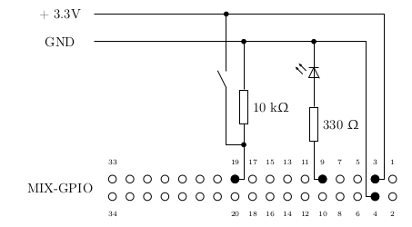

# Running program t on MIX
We will run programm t of exercise 20 in chapter 1.3.2 TAOCP (p. 161) on MIX. Programm t controls the traffic signal at corner of Del Mare Boulevard and Berkeley Avenue. This project will connect LEDs directly to the register rX and a push button to the  Overflow toggle. This will be done extending the fpga design and routing the appropriate signals to the GPIO connector at the back of MIX.


## Extending the fpga desing
Make a copy of the folder `rtl` and cd into it.
```
cd build
cp -r rtl rtl_traffic_light
cd rtl_traffic_light
```
### mix.pcf
Add the following lines to physical constraint file `mix.pcf`:

```
#at the GPIO connector you find
set_io rx 		E4	# GPIO 5
set_io tx 		B2	# GPIO 7
set_io dmred 	F5	# GPIO 9
set_io bred 	J2	# GPIO 10
set_io dmamber 	B1	# GPIO 11
set_io bamber 	H1	# GPIO 12
set_io dmgreen 	C1	# GPIO 13
set_io bgreen 	G1	# GPIO 14
set_io dmdw 	C2	# GPIO 15
set_io bdw 		J5	# GPIO 16
set_io dmw 		F4	# GPIO 17
set_io bw 		H2	# GPIO 18
set_io button 	D2	# GPIO 19
```

### mix.v
Add the following lines to the hardware description file `mix.v` to connect the Register rX with the traffic signals.

```
	assign dmgreen = RegisterX[19:18] == 2'd1;
	assign dmamber = RegisterX[19:18] == 2'd2;
	assign dmred = RegisterX[19:18] == 2'd3;
	assign bgreen = RegisterX[13:12] == 2'd1;
	assign bamber = RegisterX[13:12] == 2'd2;
	assign bred = RegisterX[13:12] == 2'd3;
	assign dmw = RegisterX[7:6] == 2'd1;
	assign dmdw = RegisterX[7:6] == 2'd2;
	assign bw = RegisterX[1:0] == 2'd1;
	assign bdw = RegisterX[1:0] == 2'd2;
```

Find the code snipped that controls the overflow toggle and add the line commented with "# traffic signal button". 

```
always @(posedge clk)
		if (reset) overflow <= 0;
		else if (button) overflow <= 1;		# traffic signal button
		else if (add2) overflow <= addof;
		else if (sub2) overflow <= subof;
		else if (ide) overflow <= (rA|rX)? ideout[30] : ideout[12];

```
### rebuild and flash to iCE40HX8K-EVB

* Rebuild the fpga project and upload. `apio clean` is needed, because otherwise the the preloaded memory will not be updated.
	```
	apio clean
	apio build -v
	apio upload
	```
	
	Tipp: change the welcome message to ensure the new rom file has been uploaded.
	
### leds and button
Connect leds and button (don't forget resistors) to the appropriate GPIO connectors as described in the `mix.pcf` file. For simplicity only one LED is shown below:



**Attention:** gpio pins 1,2,5 and 7 are already used by the internal USB-serial converter. 

### t.mixal
Compile t.mixal, upload to MIX and run the traffic signals.