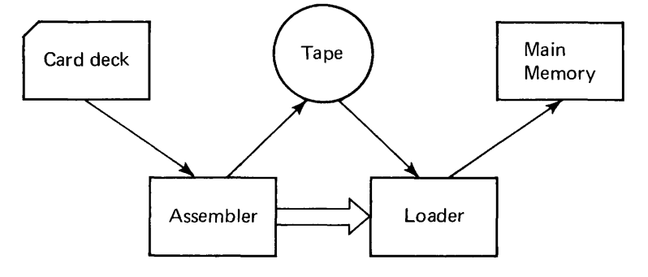

## A load and go assembler for MIX
We will run the one pass load and go assembler program `mixaload.mixal` written by James L. Peterson in his book [Computer Organisation and Assembly Language Programming](http://www.jklp.org/profession/books/index.html).

`mixaload.mixal` consists of two parts:

1. Assembler
2. Loader

The assembler reads the card deck. The mixal program written on cards is then assembled to binary form and written to tape 0. After the assembler processes the last card with the tag `END` the loader takes on execution. It reads the content of tape 0 and writes the binary code to MIX main memory. When input on tape 0 is finished, execution is startet in main memory at the location described by `END xxxx`.

The only restriction imposed on the mixal program to be processed by this load and go assembler is: Don't use memory location 3700--3999, because that's where the loader routine resides in memory.



### Example: mixaload processes program p
We will run the load and go assembler program `mixaload.mixal` on MIX. Then we will input `p.mixal` so MIX will assemble program p and finally execute it.

``` 
$ make clean
$ make
```

The output `mixaload.out` shows the result of the load and go assembler processing program p.

```
                              * TABLE OF PRIMES                                                                    1    
                 +0000000764  L          EQU  500                                                                  2    
                 +0000000022  PRINTER    EQU  18                                                                   3    
                 -0000000001  PRIME      EQU  -1                                                                   4    
                 +0000003720  BUF0       EQU  2000                                                                 5    
                 +0000003751  BUF1       EQU  BUF0+25                                                              6    
       +0000           +5670             ORIG 3000                                                                 7    
       +5670     -0000000763  C1         CON  1-L                                                                  8    
       +5671     +0000000003  C3         CON  3                                                                    9    
       +5672  +5670 00 05 11  START      LD1  C1                                                                  10    
       +5673  +5671 00 05 12             LD2  C3                                                                  11    
       +5674  +0001 00 00 61  H21        INC1 1                                                                   12    
       +5675  +0763 01 05 32             ST2  PRIME+L,1                                                           13    
       +5676  +7777 00 01 51             J1Z  H22                                                                 14    
       +5677  +0002 00 00 62  H41        INC2 2                                                                   15    
       +5700  +0002 00 02 63             ENT3 2                                                                   16    
       +5701  +0000 00 02 60  H61        ENTA 0                                                                   17    
       +5702  +0000 02 02 67             ENTX 0,2                                                                 18    
       +5703  -0001 03 05 04             DIV  PRIME,3                                                             19    
       +5704  +5677 00 01 57             JXZ  H41                                                                 20    
       +5705  -0001 03 05 70             CMPA PRIME,3                                                             21    
       +5706  +0001 00 00 63             INC3 1                                                                   22    
       +5707  +5701 00 06 47             JG   H61                                                                 23    
       +5710  +5674 00 00 47             JMP  H21                                                                 24    
       +5711  +7777 00 22 45  H22        OUT  TITLE(PRINTER)                                                      25    
       +5712  +3763 00 02 64             ENT4 BUF1+10                                                             26    
       +5713  -0062 00 02 65             ENT5 -50                                                                 27    
       +5714  +0765 00 00 65  H23        INC5 L+1                                                                 28    
       +5715  -0001 05 05 10  H42        LDA  PRIME,5                                                             29    
       +5716  +0000 00 01 05             CHAR                                                                     30    
       +5717  +0000 04 14 37             STX  0,4(1:4)                                                            31    
       +5720  +0001 00 01 64             DEC4 1                                                                   32    
       +5721  +0062 00 01 65             DEC5 50                                                                  33    
       +5722  +5715 00 02 55             J5P  H42                                                                 34    
       +5723  +0000 04 22 45             OUT  0,4(PRINTER)                                                        35    
       +5724  +0030 04 05 14             LD4  24,4                                                                36    
       +5725  +5714 00 00 55             J5N  H23                                                                 37    
       +5726  +0000 00 02 05             HLT                                                                      38    
       +5727           -0000             ORIG PRIME+1                                                             39    
       -0000     +0000000002             CON  2                                                                   40    
       +0001           +3713             ORIG BUF0-5                                                              41    
       +3713     +0611232627  TITLE      ALF  FIRST                                                               42    
       +3714     +0006113105             ALF   FIVE                                                               43    
       +3715     +0010301704             ALF   HUND                                                               44    
       +3716     +2305040021             ALF  RED P                                                               45    
       +3717     +2311160526             ALF  RIMES                                                               46    
       +3720           +3750             ORIG BUF0+24                                                             47    
       +3750     +0000003763             CON  BUF1+10                                                             48    
       +3751           +4001             ORIG BUF1+24                                                             49    
       +4001     +0000003732             CON  BUF0+10                                                             50    
       +4002           +5672             END  START                                                               51    
FIRST FIVE HUNDRED PRIMES                                                                                               
     0002 0233 0547 0877 1229 1597 1993 2371 2749 3187                                                                  
     0003 0239 0557 0881 1231 1601 1997 2377 2753 3191                                                                  
     0005 0241 0563 0883 1237 1607 1999 2381 2767 3203                                                                  
     0007 0251 0569 0887 1249 1609 2003 2383 2777 3209                                                                  
     0011 0257 0571 0907 1259 1613 2011 2389 2789 3217                                                                  
     0013 0263 0577 0911 1277 1619 2017 2393 2791 3221                                                                  
     0017 0269 0587 0919 1279 1621 2027 2399 2797 3229                                                                  
     0019 0271 0593 0929 1283 1627 2029 2411 2801 3251                                                                  
     0023 0277 0599 0937 1289 1637 2039 2417 2803 3253                                                                  
     0029 0281 0601 0941 1291 1657 2053 2423 2819 3257                                                                  
     0031 0283 0607 0947 1297 1663 2063 2437 2833 3259                                                                  
     0037 0293 0613 0953 1301 1667 2069 2441 2837 3271                                                                  
     0041 0307 0617 0967 1303 1669 2081 2447 2843 3299                                                                  
     0043 0311 0619 0971 1307 1693 2083 2459 2851 3301                                                                  
     0047 0313 0631 0977 1319 1697 2087 2467 2857 3307                                                                  
     0053 0317 0641 0983 1321 1699 2089 2473 2861 3313                                                                  
     0059 0331 0643 0991 1327 1709 2099 2477 2879 3319                                                                  
     0061 0337 0647 0997 1361 1721 2111 2503 2887 3323                                                                  
     0067 0347 0653 1009 1367 1723 2113 2521 2897 3329                                                                  
     0071 0349 0659 1013 1373 1733 2129 2531 2903 3331                                                                  
     0073 0353 0661 1019 1381 1741 2131 2539 2909 3343                                                                  
     0079 0359 0673 1021 1399 1747 2137 2543 2917 3347                                                                  
     0083 0367 0677 1031 1409 1753 2141 2549 2927 3359                                                                  
     0089 0373 0683 1033 1423 1759 2143 2551 2939 3361                                                                  
     0097 0379 0691 1039 1427 1777 2153 2557 2953 3371                                                                  
     0101 0383 0701 1049 1429 1783 2161 2579 2957 3373                                                                  
     0103 0389 0709 1051 1433 1787 2179 2591 2963 3389                                                                  
     0107 0397 0719 1061 1439 1789 2203 2593 2969 3391                                                                  
     0109 0401 0727 1063 1447 1801 2207 2609 2971 3407                                                                  
     0113 0409 0733 1069 1451 1811 2213 2617 2999 3413                                                                  
     0127 0419 0739 1087 1453 1823 2221 2621 3001 3433                                                                  
     0131 0421 0743 1091 1459 1831 2237 2633 3011 3449                                                                  
     0137 0431 0751 1093 1471 1847 2239 2647 3019 3457                                                                  
     0139 0433 0757 1097 1481 1861 2243 2657 3023 3461                                                                  
     0149 0439 0761 1103 1483 1867 2251 2659 3037 3463                                                                  
     0151 0443 0769 1109 1487 1871 2267 2663 3041 3467                                                                  
     0157 0449 0773 1117 1489 1873 2269 2671 3049 3469                                                                  
     0163 0457 0787 1123 1493 1877 2273 2677 3061 3491                                                                  
     0167 0461 0797 1129 1499 1879 2281 2683 3067 3499                                                                  
     0173 0463 0809 1151 1511 1889 2287 2687 3079 3511                                                                  
     0179 0467 0811 1153 1523 1901 2293 2689 3083 3517                                                                  
     0181 0479 0821 1163 1531 1907 2297 2693 3089 3527                                                                  
     0191 0487 0823 1171 1543 1913 2309 2699 3109 3529                                                                  
     0193 0491 0827 1181 1549 1931 2311 2707 3119 3533                                                                  
     0197 0499 0829 1187 1553 1933 2333 2711 3121 3539                                                                  
     0199 0503 0839 1193 1559 1949 2339 2713 3137 3541                                                                  
     0211 0509 0853 1201 1567 1951 2341 2719 3163 3547                                                                  
     0223 0521 0857 1213 1571 1973 2347 2729 3167 3557                                                                  
     0227 0523 0859 1217 1579 1979 2351 2731 3169 3559                                                                  
     0229 0541 0863 1223 1583 1987 2357 2741 3181 3571                                                                  

```

The first part of the output shows the result of the assembler processing the program p. Addresses and binary codes are represented in octal form.

The second part of the output shows the result of program p, which is loaded into memory by the loader and executed.

